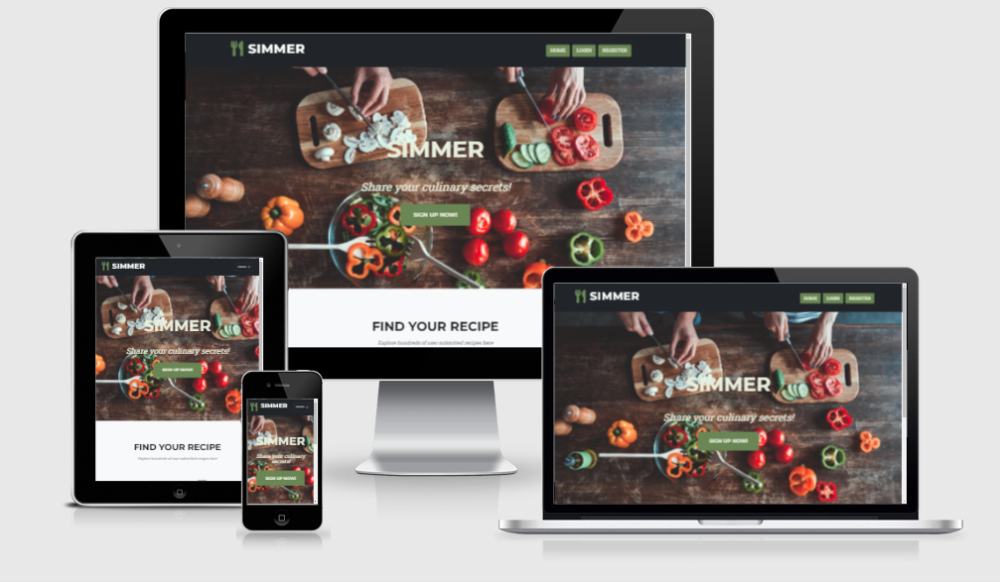

# [Simmer - Share your culinary secrets!](https://simmer-recipes.herokuapp.com/)



---
## Table of Contents
1. [**UX**](#ux)
    - [**Strategy**](#strategy)
    - [**User Stories**](#user-stories)
    - [**Scope**](#scope)
    - [**Design**](#design)
        - [**Framework**](#framework)
        - [**Color Scheme**](#color-scheme)
        - [**Icons**](#icons)
        - [**Typography**](#typography)
    - [**Wireframes**](#wireframes)

2. [**Features**](#features)
    - [**Existing Features**](#existing-features)
    - [**Features Left to Implement**](#features-left-to-implement)

3. [**Technologies Used**](#technologies-used)

4. [**Testing**](#testing)

5. [**Deployment**](#deployment)
   

---

## UX

### Strategy

The main requirements of this project was to create a recipe sharing platform that appeals to a large audience of home cooks. To achieve this, the website needs to be simple to use and understand and also has to look visually appealing. One major consideration for the project was allowing each user to create, read, update, and delete recipes (CRUD).

### User stories

As a User I want ....

- To view the site from a range of devices with different resolutions  
- To be able to easily navigate the website and find my appropriate section
- To be able to create a profile in which to create and edit my own recipes  
- To be able to delete only my own recipes
- To be able to view other user's recipes without needing to register  
- To view recipes that have been created by other users without signing up
- To be able to search for other user's recipes by keywords


### Scope

- Home page that encourages users to register with a call to action as the first section they encounter. Also displays a random selection of recipes submitted by other users.
- Navigation bar that persists throughout the entire site. Links to Homepage, Recipe section, login, sign up, logout.
- Form for registered users to use to submit recipe details.
- Functionality for registered users to Create, read, update, and delete (CRUD) recipes.
- Recipe section that displays users' recipes as a gallery of cards.
- Recipe section search bar that allows users to search for recipes based on keywords.
- Login/signup forms that allow users to access their recipes to edit using a password. 


### Design

#### Framework
I chose to use a bootstrap template to enable me to spend more development time writing the code for the backend of the website. I would then write custom HTML and CSS to personalize the website. 
#### Color scheme

I used the website: Coolers to create a color palette for my website. After selecting an appropriate Hero image I could use this to generate a color palette. I wanted the website to look fresh and vibrant to complement the ingredients used in the recipes. 

- E8EEDC Beige
- A37A74 Burnished Brown
- 6A9DB5 Air Superiority Blue
- 698654 Russian Green 
- 2D2F30 Jet
#### Icons
I chose to use Font awesome to provide icons for my Navigation bar titles. 
#### Typography
For this project I chose to stick to two fonts to maintain consistency across the website. These were provided by Google fonts. 

- Montserrat - For titles and headings
- Roboto - For all other text. 

### Wireframes

You can view the wireframes used for this project [here](https://github.com/CJepps/Simmer-recipe-sharing/tree/main/static/assets/img/readme-images/wireframes)
 
---
## Features
### Existing Features
### Features left to implement 
---
## Technologies used
 
## Languages
---
1. HTML5
2. CSS3 
3. JavaScript
4. Python 3.6.8

## Additional Frameworks, Libraries, and Programs used
---
3. Bootstrap 4.4.1
* Used the grid system to aid with the responsiveness of the website
4. Font awesome
* Used to provide icons for the website
5. Git
* used for version control
6. GitHub
* used to store pushed code in a repository
7. Balsamiq
* Used to create wireframes at the start of the project
8. jQuery 
* included with bootstrap. 
9. [Googlefonts CDN](https://fonts.google.com/) 
* used to import 'Righteous' and 'Montserrat' fonts to style text
10. [amiresponsive](http://ami.responsivedesign.is/)
* used to create mockups of the website at different resolutions (for the first image of readme)
11. LambdaTest
* used to test responsiveness on a range of browsers 
12. MongoDB Atlas
* used as a non relational database to store backend data
13. PyMongo 3.12.0
* used to interact between python and MongoDB 
---
## Testing(against user stories) 
I manually tested the website with debugger.
```python
debug=True
```
Whenever the app crashed, debugger displayed an error message that made it clear what was causing the error. I was able to resolve issues by going back to the routes and templates and examining the relevant code.

**User Registration**
To test this, I created my own account and tested website features with it. I can log in, add, edit, and delete my own recipes. I also made test accounts to see if it was possible to delete or edit another user's recipes from another account.

**To view the site from a range of devices with different resolutions**

**To be able to easily navigate the website and find my appropriate section**

**To be able to create a profile in which to create and edit my own recipes**

**To be able to delete only my own recipes**

**To be able to view other user's recipes without needing to register**

**To view recipes that have been created by other users without signing up**

**To be able to search for other user's recipes by keywords**


### Validator testing 


**HTML**
- [W3C HTML Validator](https://validator.w3.org) - No errors. "Document checking completed. No errors or warnings to show". 


**CSS**
- [W3C CSS Validator](https://jigsaw.w3.org/css-validator/) -No errors. Validator results can be viewed [here](http://jigsaw.w3.org/css-validator/validator?uri=https%3A%2F%2Fsimmer-recipes.herokuapp.com%2F&profile=css3svg&usermedium=all&warning=1&vextwarning=)

**JavaScript**
- [Esprima](https://esprima.org/demo/validate.html) - No Errors. Code is syntactically valid. The only JavaScript in this project was provided by the bootstrap template for navbar shrinking

## Further testing 

### Browser compatibility 
* Lambda test was used to test the website across a range of browsers.
* Manual testing was also undertaken using DevTools in Google Chrome to test responsiveness at different resolutions. 


---
# Deployment

## Local Deployment
(created using tawnygoody's Tarmachan [readme](https://github.com/Tawnygoody/Tarmachan/blob/main/README.md) as a guide)

Before deploying the project there are some requirements to be set up first.

First ensure the following are set up on your chosen IDE:
- [PIP3](https://pypi.org/project/pip/) Python package installer. 
- [Python 3.8.12](https://www.python.org/downloads/release/python-360/) or higher.
- [Git](https://git-scm.com/) version control.
- [MongoDB Atlas](https://www.mongodb.com/cloud/atlas) to create database


To set the project up locally you can follow the following steps: 

1. Navigate to the repository - [Simmer repository](https://github.com/CJepps/Simmer-recipe-sharing)

2. Click the code dropdown button, ensure the HTTPS tab is selected in the dropdown and copy the url. 

3. In your IDE navigate to the desired directory. 

4. Open the terminal and enter the following code: 
    - ```
        git clone https://github.com/CJepps/Simmer-recipe-sharing.git
        ``` 

5. To install the required dependencies needed to run the application type the following into the terminal: 
    - ```
        pip3 install -r requirements.txt
        ```

6. Environment variables will then need to be set up. This can be done in a couple of ways:
- Create a **.env** file with the connection to your MongoDB database, and a secret key. It should look something like this:
```
MONGO_URI='Your Mongo URI Details'
SECRET_KEY='Your secret key' 
```  
- Create a **.flaskenv** file, specifying the following:
    - `FLASK_APP=run.py`
    - `FLASK_ENV=development`
- Install all required modules with the command:
    - `sudo -H pip3 -r requirements.txt`
- Create a new database on MongoDB and name it simmerDB. In the database, create the following two collections:

**user**
```
_id: <ObjectId>
username: <String>
password: <String>

```
**recipes**
```
_id: <ObjectId>
recipe_title: <String>
recipe_image_url: <String>
recipe_ingredients: <String>
recipe_method: <String>
recipe_cooking_time: <String>
created_by: <String>

```

- You can now run the application by running the following command:
    - `flask run`
    - The website will run now on *localhost* `http://127.0.0.1:5000` 


## Deployment to Heroku
(created using andreasdk - dcd-recipes [readme](https://github.com/andreasdk/dcd-recipes/blob/master/README.md#local-deployment) as a guide)

The app can be deployed via [Heroku](https://www.heroku.com/). To deploy, you need to do the following:

- In the terminal, create a `requirements.txt` file using the command `pip freeze > requirements.txt`.
- In the terminal, create a `Procfile` by running the `echo web: python app.py > Procfile` command.
- Push these files to your GitHub repository.
- Create a new app on [Heroku dashboard](https://dashboard.heroku.com/apps), give it a name and set the region to whichever is closest to you.
- Link the Heroku app to your GitHub repository.
- Set the config vars as follows:

| Key | Value |
 --- | ---
DEBUG | FALSE
IP | 0.0.0.0
MONGO_URI | `mongodb+srv://<username>:<password>@<cluster_name>-qtxun.mongodb.net/<database_name>?retryWrites=true&w=majority`
PORT | 5000
SECRET_KEY | `<your_secret_key>`

The MONGO_URI and SECRET_KEY should match the ones in your **.env** file.

- Click 'Deploy' in the Heroku Dashboard, and select 'enable automatic deployment'.

- It should now be possible to launch the app via Heroku.